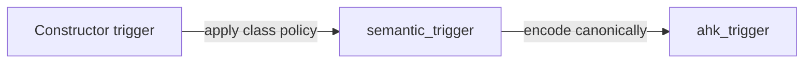

# Hotstrings and options

## Trigger representations

The generic hotstring model keeps trigger **meaning** separate from AutoHotkey
source spelling.

Each initialized [`Hotstring`][hotstring.core.models.Hotstring] stores two
trigger representations:

- `semantic_trigger` — the actual characters AutoHotkey should recognize;
- `ahk_trigger` — the deterministic, minimally escaped spelling used when
  rendering AHK source.

The constructor argument `trigger` is an `InitVar`, so it is not retained as a
third ambiguous representation after initialization.

By default, `Hotstring` and candidate classes interpret constructor `trigger`
as semantic text. [`ExistingHotstring`][hotstring.core.models.ExistingHotstring]
receives trigger text extracted from an AHK source file, so it shadows the class
policy `TRIGGER_INPUT_IS_AHK_SOURCE = True`. The base
[`Hotstring.__post_init__()`][hotstring.core.models.Hotstring.__post_init__]
still owns the same resolution algorithm for every subclass:



When
[`CHECK_TRIGGER_ROUND_TRIP`][hotstring.core.models.CHECK_TRIGGER_ROUND_TRIP] is
enabled, initialization also verifies the conversion invariant:

```python
ahk_to_semantic_trigger(ahk_trigger) == semantic_trigger
```

This is an internal consistency check. A failure indicates a bug in the
conversion contract rather than invalid user input.

## Trigger conversion and canonicalization

[`semantic_to_ahk_trigger()`][hotstring.core.trigger.semantic_to_ahk_trigger]
produces one deterministic, minimally escaped AHK representation.

[`ahk_to_semantic_trigger()`][hotstring.core.trigger.ahk_to_semantic_trigger]
performs the reverse semantic conversion: it interprets an AHK source spelling
and returns the trigger characters that spelling represents. It may therefore
accept multiple valid source spellings that have the same semantic result.

During canonical encoding, characters which always require source escaping,
such as a literal backtick or supported control characters, are escaped
unconditionally. Colons and semicolons are escaped only when their source
context requires it:

- `:` is escaped only as needed to prevent an unescaped `::` sequence inside
  the trigger or against the declaration delimiter;
- `;` is escaped only when a literal source space immediately precedes it and
  it would otherwise begin a comment.

Consequently, multiple valid source spellings can decode to the same semantic
trigger. For example:

```text
foo:bar
foo`:bar
```

both decode to:

```text
foo:bar
```

and re-encode canonically as the minimally escaped form:

```text
foo:bar
```

The helpers are therefore intentionally asymmetric with respect to source
spelling. The supported semantic round trip is:

```python
ahk_to_semantic_trigger(semantic_to_ahk_trigger(value)) == value
```

for every semantic trigger accepted by the encoder. Re-encoding arbitrary AHK
source is allowed to canonicalize optional or unnecessary escapes.

## Case-insensitive matching key

Conflict detection operates on semantic trigger text, never on escaped AHK
source spelling. Each hotstring therefore caches a derived
`case_insensitive_semantic_trigger_key`.

On Windows the key is produced with the Microsoft CRT under an explicit C
locale to follow AutoHotkey's case-insensitive comparison basis as closely as
possible. On non-Windows systems, `str.lower()` is used as a deterministic
fallback. The key is runtime-derived state and is not persisted in the source
cache.

## Hotstring rendering

[`Hotstring.render(content=None)`][hotstring.core.models.Hotstring.render]
renders the canonical option declaration and `ahk_trigger`, never the
constructor input.

`content` means everything emitted after the declaration's second `::`. It is
therefore intentionally broader than an inline replacement RHS: depending on
AutoHotkey syntax and options, it may be replacement text, executable content,
or multiline block content.

The generic
[`Hotstring.to_ahk_string_literal()`][hotstring.core.models.Hotstring.to_ahk_string_literal]
helper separately handles AHK double-quoted string syntax. It escapes literal
backticks and quotes plus all supported AHK control escapes (`r`, `n`, `b`,
`t`, `v`, `a`, and `f`). Trigger encoding and quoted-string encoding remain
separate because their syntax rules are different.

## Declared option state

[`HotstringOptions`][hotstring.core.options.HotstringOptions] represents what is
explicitly declared on one hotstring. Every omitted option uses the shared
sentinel:

```python
InheritedState.INHERIT
```

This is distinct from the actual semantic value of the option. For example,
[`CaseMode`][hotstring.core.options.CaseMode] contains only real case modes,
while inheritance is represented by
[`InheritedState`][hotstring.core.options.InheritedState] rather than by a
synthetic `CaseMode.INHERIT` member.

Two-state settings use the [`SettingState`][hotstring.core.options.SettingState]
members `SettingState.ENABLED` and `SettingState.DISABLED`. The `*` option is
exposed semantically as `ending_character_optional`, so its mapping is direct:

| Declaration | Semantic state           |
| ----------- | ------------------------ |
| `*`         | `SettingState.ENABLED`   |
| `*0`        | `SettingState.DISABLED`  |
| omitted     | `InheritedState.INHERIT` |

[`declaration()`][hotstring.core.options.HotstringOptions.declaration]
serializes the parsed semantic state back to one canonical option string.
Repeated or contradictory source options therefore collapse to the last
effective value rather than being reproduced verbatim.

## Resolved option state

[`ResolvedHotstringOptions`][hotstring.core.options.ResolvedHotstringOptions] is
a separate dataclass rather than a subclass of
[`HotstringOptions`][hotstring.core.options.HotstringOptions]. Its fields
contain only concrete values; none are typed with
[`InheritedState`][hotstring.core.options.InheritedState].

[`ResolvedHotstringOptions.from_options()`][hotstring.core.options.ResolvedHotstringOptions.from_options]
constructs a resolved object from:

1. one parsed `HotstringOptions` declaration; and
2. the fully resolved defaults applicable at that declaration position.

Explicit values override those defaults. `InheritedState.INHERIT` leaves the
corresponding default unchanged. This makes resolution context-sensitive
without making `HotstringOptions` itself aware of file position,
`#Hotstring`, or other sources of defaults.

## Send mode

The declared [`SendMode`][hotstring.core.options.SendMode] enum represents the
three actual hotstring send-mode choices:

```text
INPUT
PLAY
EVENT
```

The declaration mapping is:

| Hotstring option | Declared value           |
| ---------------- | ------------------------ |
| `SI`             | `SendMode.INPUT`         |
| `SP`             | `SendMode.PLAY`          |
| `SE`             | `SendMode.EVENT`         |
| omitted          | `InheritedState.INHERIT` |

Input mode has two distinct effective fallback behaviors, so the resolved model
uses a separate four-state
[`ResolvedSendMode`][hotstring.core.options.ResolvedSendMode] enum:

```python
class ResolvedSendMode(Enum):
    INPUT_WITH_PLAY_FALLBACK = auto()
    INPUT_WITH_EVENT_FALLBACK = auto()
    PLAY = auto()
    EVENT = auto()
```

`ResolvedHotstringOptions.send_mode` is therefore typed as
`ResolvedSendMode`.

The important mappings are:

| Effective source            | Resolved value                               |
| --------------------------- | -------------------------------------------- |
| explicit `SI`               | `ResolvedSendMode.INPUT_WITH_PLAY_FALLBACK`  |
| AutoHotkey built-in default | `ResolvedSendMode.INPUT_WITH_EVENT_FALLBACK` |
| `SP`                        | `ResolvedSendMode.PLAY`                      |
| `SE`                        | `ResolvedSendMode.EVENT`                     |

`InheritedState.INHERIT` does not inherently mean
`INPUT_WITH_EVENT_FALLBACK`. It means to use the currently applicable hotstring
default. If inheritance eventually reaches AutoHotkey's untouched built-in
default, the resulting resolved value is
`ResolvedSendMode.INPUT_WITH_EVENT_FALLBACK`. If an applicable default has
already selected `SI`, `SP`, or `SE`, the inherited value resolves according
to that default instead.

## Candidate hierarchy

The generic model hierarchy is:

???+ abstract "Candidate hotstring class hierarchy"

    ```mermaid
    classDiagram
        direction TB

        Hotstring <|-- CandidateHotstring
        CandidateHotstring <|-- AutoCorrect2CandidateHotstring

        class CandidateHotstring {
            <<abstract>>
        }
    ```

[`CandidateHotstring`][hotstring.core.models.CandidateHotstring] stores the
semantic `replacement` and requires a concrete subclass to derive the
AutoHotkey content corresponding to that replacement. The public
[`Hotstring.render()`][hotstring.core.models.Hotstring.render] contract remains
inherited unchanged, so the hierarchy does not narrow the method signature.

[`AutoCorrect2CandidateHotstring`][hotstring.autocorrect2.models.AutoCorrect2CandidateHotstring]
supplies the AutoCorrect2-specific mapping: the replacement is converted to a
complete escaped AutoHotkey string literal and wrapped in `f(...)`.
