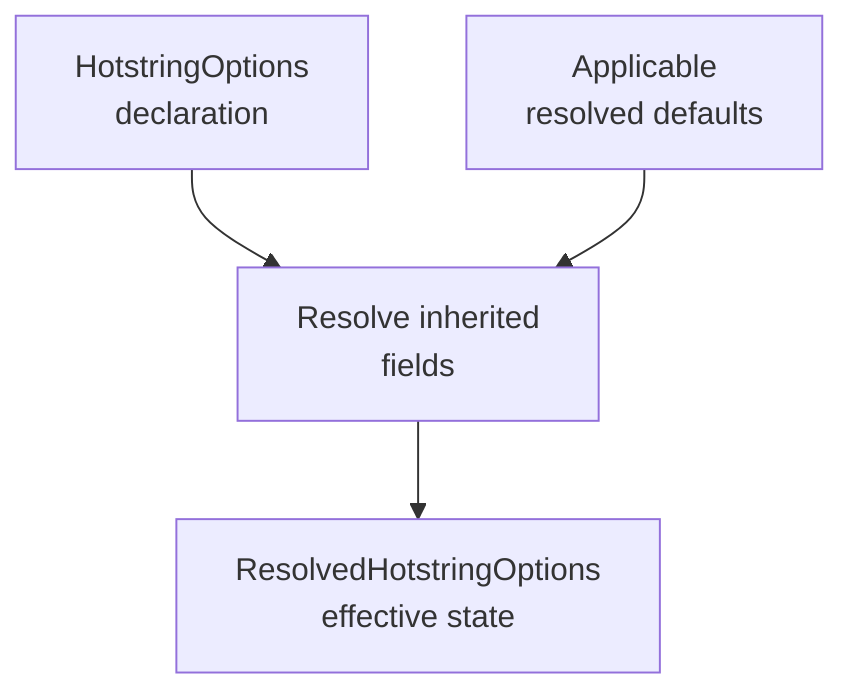

# AutoCorrect2 configuration

The default integration expects these required hotstring sources:

- `Core/AutoCorrectHotstrings.ahk`
- `Core/PersonalHotstrings.ahk`
- `Includes/DateTool.ahk`

`Core/GeneratedHotstrings.ahk` is optional on the first run and is scanned once
it exists.

## Matching defaults

[`HotstringOptions`][hotstring.core.options.HotstringOptions] does not bake
AutoHotkey defaults into omitted fields. Omitted values remain the `INHERIT`
member of [`InheritedState`][hotstring.core.options.InheritedState] until a
[`ResolvedHotstringOptions`][hotstring.core.options.ResolvedHotstringOptions] is
created with the defaults that apply at that source position.

Resolution combines the parsed declaration with the fully resolved defaults
applicable at that source position:

Until positional directive analysis is implemented, the AutoCorrect2 pipeline
can resolve declarations against the configured built-in/default option object.

The conflict checker currently assumes the configured ending-character set and
uses only the resolved recognition-related fields required for matching.
