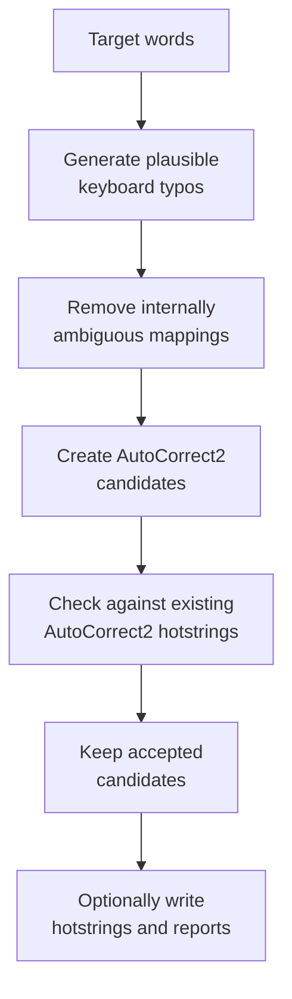
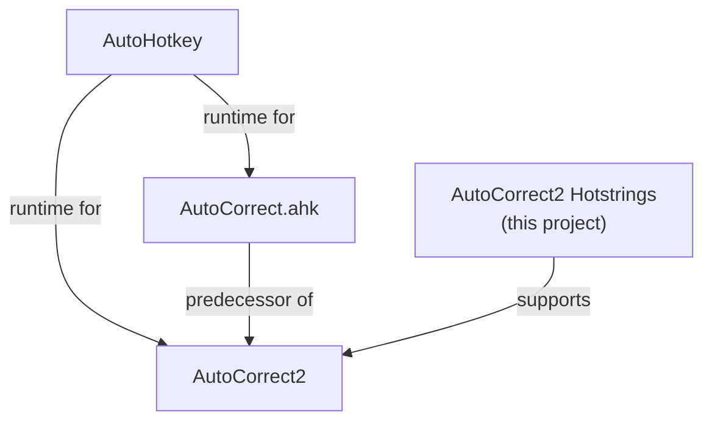

# Project Background

## Purpose

**AutoCorrect2 Hotstrings** is a supporting project for
[AutoCorrect2](https://github.com/kunkel321/AutoCorrect2). Its purpose is to
generate plausible keyboard-typo hotstrings, evaluate whether those hotstrings
are safe to use, and prepare accepted corrections for integration with an
existing AutoCorrect2 setup.

The project focuses on a problem that becomes increasingly important as an
autocorrect library grows: a generated correction must not merely look
plausible. Its trigger also needs to behave safely alongside other generated
hotstrings and the hotstrings that already exist in AutoCorrect2.

At a high level, the workflow is:

The project is therefore **not an autocorrect runtime of its own**. AutoHotkey
and AutoCorrect2 remain responsible for recognizing and executing hotstrings.
This project provides generation, analysis, validation, and integration tooling
around that existing system.

## AutoHotkey and hotstrings

[AutoHotkey](https://www.autohotkey.com/) is a Windows automation and scripting
language. One of its core text-automation features is the
[hotstring](https://www.autohotkey.com/docs/v2/Hotstrings.htm).

A hotstring watches typed input for a trigger and reacts when that trigger is
recognized. A simple hotstring can replace one piece of text with another, while
an execute hotstring can invoke arbitrary AutoHotkey code.

In its simplest form, an autocorrect hotstring maps a **misspelled trigger**
to an **intended word**.

This makes hotstrings a natural foundation for a continuously running
autocorrect system. AutoHotkey also provides options that change how triggers
are recognized, including case sensitivity, whether an ending character is
required, and whether matching is allowed inside words.

Those recognition rules matter to this project because two hotstrings can
interfere even when their trigger strings are not identical. Conflict detection
therefore needs to model the relevant AutoHotkey hotstring semantics rather than
performing only simple string equality checks.

## The original AutoCorrect.ahk

The lineage begins with **AutoCorrect.ahk**, initially released by Jim Biancolo
on September 24, 2006.

The original script implemented autocorrection in AutoHotkey using lists of
common misspellings. Its own introduction emphasized an important limitation:
an autocorrect system should focus on corrections that are sufficiently
unambiguous rather than attempting to silently correct every possible
misspelling.

That distinction remains useful today. An incorrect automatic correction can be
worse than leaving a questionable word untouched, because the replacement may
look valid and no longer be caught by a conventional spellchecker.

The script was expanded over time with additional misspellings and correction
rules, helping establish the AutoHotkey hotstring-based autocorrect approach
from which later projects evolved.

## AutoCorrect2

[AutoCorrect2](https://github.com/kunkel321/AutoCorrect2) is a modern AutoHotkey
v2 project built on that lineage.

It began as a version of the earlier `AutoCorrect.ahk`, but has evolved into a
suite of interrelated AutoHotkey v2 scripts and tools for using, creating,
managing, analyzing, and improving autocorrect hotstrings.

That broader tooling is important: maintaining a large autocorrect collection is
not just a matter of adding more typo/replacement pairs. It also involves
examining trigger behavior, refining entries, managing generated content, and
avoiding corrections that would interfere with valid typing or with other
hotstrings.

AutoCorrect2 provides the runtime environment and surrounding tools in which the
hotstrings produced by this project are intended to operate.

## Where this project fits

The relationship can be summarized as:

This project operates at the generation and analysis layer.

Given target words, it can generate typo candidates that mimic plausible
keyboard mistakes. Those candidates are then filtered before integration:

- ambiguous generated mappings can be removed;
- generated hotstrings can be checked against one another;
- candidates can be checked against existing AutoCorrect2 hotstrings;
- AutoHotkey recognition rules relevant to conflicts can be taken into account;
- accepted entries can be rendered in AutoCorrect2-compatible form;
- reports can explain which candidates were accepted or rejected.

The intent is not to maximize the number of generated corrections. The intent is
to produce a set of useful candidates while reducing unsafe or ambiguous
automatic behavior.

## Design principle

A generated typo is only useful if correcting it automatically is reasonably
safe.

That principle influences the architecture of the project. Generation and
conflict analysis are deliberately separate concerns: producing a plausible typo
does not automatically mean that the corresponding hotstring should be added.

The project therefore treats generation as the beginning of the pipeline, not
the final decision.

## Further reading

- [AutoHotkey](https://www.autohotkey.com/)
- [AutoHotkey v2 hotstrings](https://www.autohotkey.com/docs/v2/Hotstrings.htm)
- [AutoCorrect2 on GitHub](https://github.com/kunkel321/AutoCorrect2)
- [Original AutoCorrect.ahk source mirror](https://github.com/denolfe/AutoHotkey/blob/master/Core/AutoCorrect.ahk)
