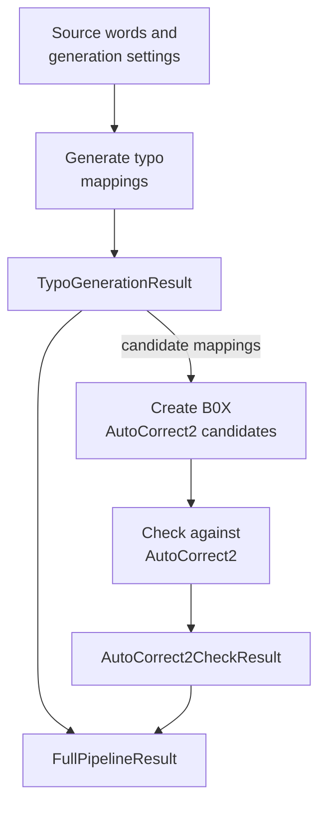

# Full pipeline

[`run_full_pipeline()`][hotstring.pipeline.run_full_pipeline] composes
[`run_typo_generation()`][hotstring.pipeline.run_typo_generation] with
[`run_autocorrect2_check()`][hotstring.pipeline.run_autocorrect2_check] and
returns a [`FullPipelineResult`][hotstring.pipeline.FullPipelineResult]:

The adaptation step converts each surviving noisy-to-target mapping into an
[`AutoCorrect2CandidateHotstring`][hotstring.autocorrect2.models.AutoCorrect2CandidateHotstring]
using the fixed generated option set `B0X`. Typo generation itself has no
dependency on
[`HotstringOptions`][hotstring.core.options.HotstringOptions] or AutoCorrect2.

The full pipeline disables stage-specific report writing while composing the
two stages and creates one combined report at the end when requested.
