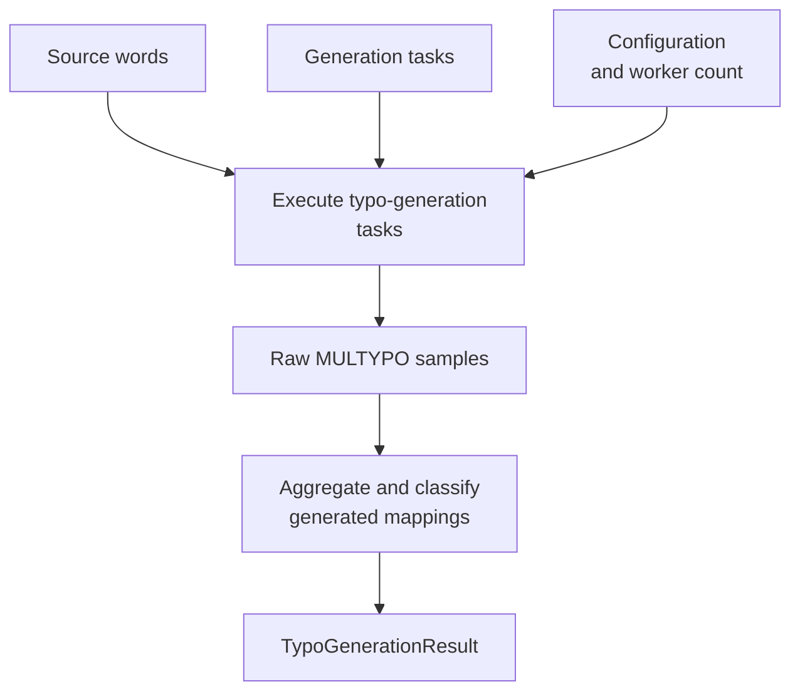

# Typo generation

This standalone workflow generates and filters typo mappings without loading
AutoCorrect2 data.

[`run_typo_generation()`][hotstring.pipeline.run_typo_generation] accepts source
words, an ordered sequence of
[`TypoGenerationTask`][hotstring.typo_generation.models.TypoGenerationTask]
objects, a
[`TypoGenerationConfig`][hotstring.typo_generation.models.TypoGenerationConfig],
and an optional `n_workers` value.

`TypoGenerationResult.candidates` maps each unambiguous noisy form to exactly
one target word. `clashes` contains noisy forms that mapped to multiple target
words and are therefore removed before any AutoCorrect2 processing.

This workflow has no dependency on AutoCorrect2 hotstring models or option
policies.
